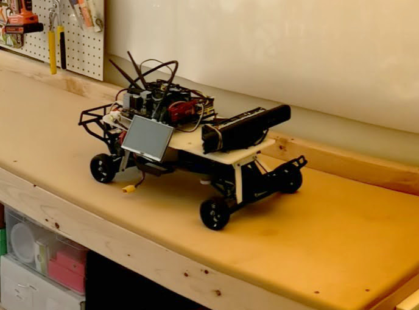
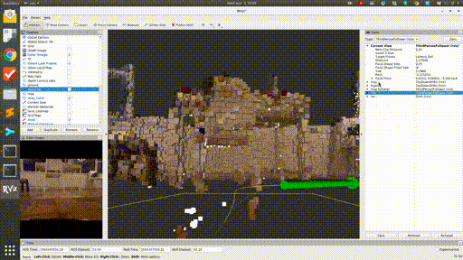

# Gudrun

This robot can be thought of as a variant of the [Donkey car](http://www.donkeycar.com/), using one of the [recommended chassis](https://hobbyking.com/en_us/trooper-pro-4x4-1-10-brushless-sct-arr.html). 
However, instead of controlling it with a Raspberry Pi, I use [a mini-ITX computer I built for a previous project](https://pcpartpicker.com/user/tsbertalan/saved/#view=dk9GXL). In future work, it might be nice to replace the motherboard with a slim-mini-ITX, a standard which includes a 19VDC power jack. I use something like [this](https://www.amazon.com/dp/B005TWE6B8/?coliid=I3T66Y7O6B2HJK&colid=3LRY6AZNFBVCM&psc=0&ref_=lv_ov_lig_dp_it) to provide motherboard power from a ~16V DC source, with a 12V regulator between.

[I use this battery](https://hobbyking.com/en_us/multistar-high-capacity-4s-10000mah-multi-rotor-lipo-pack.html) which can source 100 amps according to [this calculator](https://www.kritikalmass.net/battery-calculator/index.php), and appears to be fine for about an hour of use powering all sensors, SLAM, and the drive motor.

In a later iteration, I might use the more power-efficient [Nvidia TX2](https://devtalk.nvidia.com/default/topic/1024102/jetson-tx2/jetson-tx2-power-consumption/), but, for this build, I want to minimize the specialness of the computer as much as possible, so that everything is just standard Ubuntu. (The TX2, like the Raspberry Pi, runs linux with an ARM CPU, instead of a "normal" x86_64 CPU, meaning installing software is often harder.)

[Gudrun](https://en.wikipedia.org/wiki/Gudrun) will be the successor to two previous builds of mine, [Hogni](https://github.com/tsbertalan/hogni) and [Gunnar](https://github.com/tsbertalan/gunnar), all three of whom were mythologically siblings. (Also, note to self, if I want to continue this naming scheme, there's a [good list at the bottom](https://en.wikipedia.org/wiki/Gudrun#Family_relations) of that article.)

