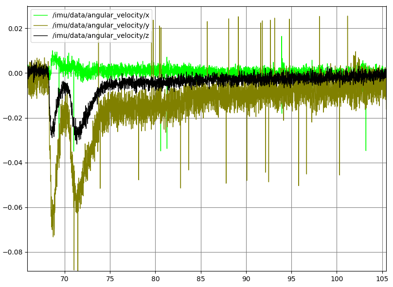

In order to improve upon the visual-only odometry from RTAB-Map, I want to use `robot_localization` to fuse in accelerometer, gyroscope, wheel encoder/steering angle, and maybe magnetometer information. Step one in this is getting reliable accelerometer/gyroscope data from an IMU. I've had a [Adafruit 9DoF IMU](https://www.adafruit.com/product/1714) on hand for a few years, without really making use of it. So, I soldered it to an Arduino Pro Micro, and bolted the breadboard holding both to the car's frame, in an orientation that was easy to express with a manually-constructed `static_transform_publisher` (visible in the gif above) (due to my sloppy construction, this might not be exactly ground-truth accurate, but it's Good Enough).

As an aide, these Pro Micros are quickly becoming a favorite of mine for making little USB peripherals. You can get them for about $8 each in packs of three; unlike Pro Minis, they have onboard USB; and they're faster than Nanos (Micro:Nano::Leonardo::Uno). Using a [fairly ugly hack](https://github.com/tsbertalan/gudrun/blob/master/src/gudrun_sensors/upload_with_specified_vid_pid.py) of modifying the boards.txt file before flashing, and restoring the original afterwards, I can modify the vendor and product ID of the devices, and then [search for the corresponding USB device later](https://github.com/tsbertalan/gudrun/blob/master/src/gudrun_sensors/get_usb_device_by_ID.py) when I want to connect it. So, I have now three of these little self-contained USB devices (IMU, encoders, and ESC interface) connected to the main board by six-inch cables (both ends for the IMU are visible in the above photo), and all can be unambiguously identified on every boot, though the `/dev/ttyAM*` order might change.

I then started experimenting with some firmware (sorry, "sketches"). After experimenting a bit, I became dissatisfied with the [provided (stateless) sensor fusion code](https://github.com/adafruit/Adafruit_9DOF/blob/master/Adafruit_9DOF.cpp#L317). I may have just been using it wrong, but this code fuses the orientation into "Euler angles", without specifying what convention this used, or in what frame these angles were written, and didn't make any use of the on-board magnetometer.

However, what is clear according to [REP-145](http://www.ros.org/reps/rep-0145.html) is the "sensor frame" for the linear acceleration and angular velocity. Linear acceleration is a translation-like quantity, and so simple to transform. Angular velocity, despite the name, is *not*  a rotation-like quantity. "The rotational velocity is right handed with respect to the body axes, and independent of the orientation of the device." In fact, this is just what is already reported by the [accelerometer's](https://github.com/adafruit/Adafruit_LSM303DLHC/blob/master/Adafruit_LSM303_U.cpp#L180) and [gyroscope's](https://github.com/adafruit/Adafruit_L3GD20_U/blob/master/Adafruit_L3GD20_U.cpp#L253) respective `getEvent` methods.

For that matter, this is also true of the [magnetometer](https://github.com/adafruit/Adafruit_LSM303DLHC/blob/master/Adafruit_LSM303_U.cpp#L435), though I've decided not to use it for the time being. To use it properly, I'd need to do some calibration to remove the influence of the motor's magnetism, which I don't want to do right now. (See below.)

So, I wrote firmware that packaged up the accelerometer, gyroscope, and magnetometer into a 9-float struct, preceded that by an `S` byte, used `serial.write` to put that onto the USB, and then used an `E` byte to mark the end of the packet. I read this into Python on the PC side using `floats = struct.unpack('<fffffffff', bytes)`, did some unit conversions, and populated my ROS messages with this data.

To keep my options open, I also wrote code to publish the firmware-fused orientation, using `tf.transformations.quaternion_from_euler` to convert it to the quaternion expected for `Imu.orientation.[x,y,z,w]`. However, `quaternion_from_euler` rightly has a second argument for specifiying which of the 24 valid Euler conventions the input uses, and I don't know what to tell it. So, I suspect the generated quaternion might be garbage, but haven't checked. What I *have*  checked is the publish rate with and without this option enabled, and it seems that this brings us from 260 Hz down to about 150 Hz. So, it's disabled for now.

I monitored the data from this pipeline-so-far in rqt, and found that, at rest, the three gyro components were nonzero. So, I subtracted their unadjusted quiescent levels before publishing. Without this, there was steady and visible heading-drift over time.

Amazingly, after tuning the gyro offsets, I tried simply breathing on the chip, and this warming was enough to cause a sudden drift.

Note of course that the vertical scale here is still quite small. (The horizontal axis in all these rqt plots is time in seconds.) It takes about four minutes to come back to its previous temperature, judging by the time it takes for the slope to return to its previous value. Interestingly, when I made the above plot, the slope before breathing was, due to my calibrations, nearly level on this 0.15 vertical scale. As I write this later in the evening, it's neutral slope is decreasing. At first, I thought this was due to the cooling of the evening, and that of course a temperature calibration curve should be written for this (which is what the the extra DoF in the Adafruit 10 DoF would be for). 

However, after I let it run over night, it seemed more that the varying slopes (in the orientation channel, at least) were just due to the regular, very slow rotation (with a period of about 1.4 hours).

A better test then would be to record not the fused heading `/imu/data/orientation/z`, but the raw gyroscope data. Maybe later I'll try recording that over a 24 hour period. I'd plot, say, the absolute value of the gyro readings on a log scale.

This quiescent drift would certainly go away if we incorporated a magnetometer, as I did temporarily for the following plot.

Here, I breathed on the sensor at about t=40 seconds, and it promptly returned to its previous orientation (and I expect it will hold this position as long as the magnetic field nearby holds steady).

But that ostensibly "global" orientation is likely not one in which North is correct, since a big portion of the sensed magnetic field is due to the nearby permanent magnet in the car's motor. So, I'll need to calibrate that away before setting `use_mag=True` in the `imu_filter_madgwick` settings.

Now, I need to transform the wheel speed/turning angle into something like a `Twist` odometry message, and get all this data into `robot_localization`.
