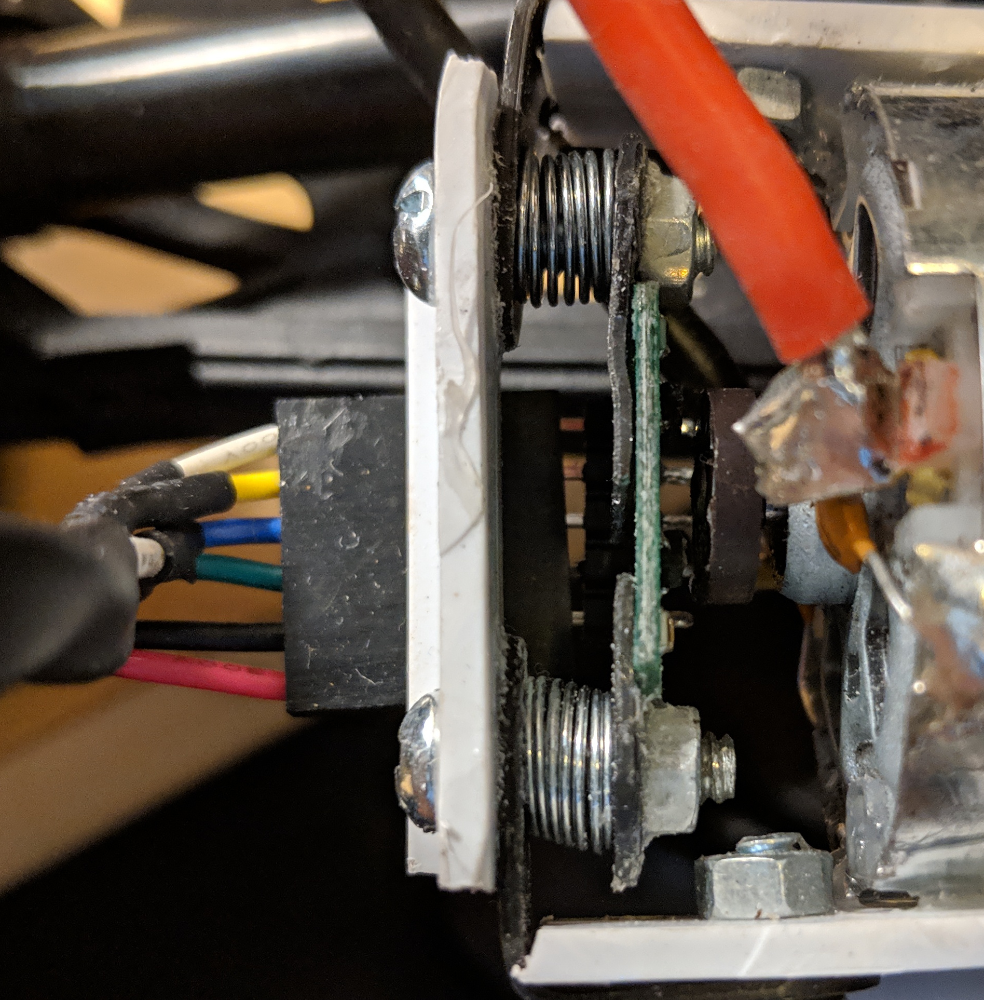
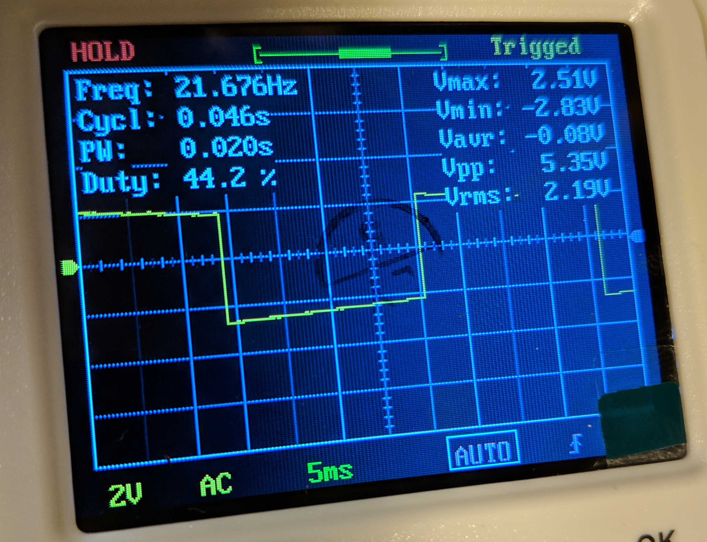

After my old encoder (salvaged from a stripped-out [Pololu gearmotor](https://www.pololu.com/product/3207)) flew apart under centrifugal strain when I accidentally set the motors to full-speed with my bad ESC code, I made a replacement using [this kit, also from Pololu](https://www.amazon.com/dp/B07K8WHKWX).

Since the shaft of the motor was a little too big for the toroidal magnet, I *gently* drilled it out a bit. But then the hole was a little too large. Hoping for the best (so far, my luck seems to be holding), I simply super-glued it to the shaft.

The next problem was mounting the Hall-effect sensor carrier board near enough to magnet to pick it up. I had already discarded the idea of mounting it under the magnet, as designed (I guess I might have just gotten lucky with the mounting orientation), since I wanted to keep this thing as disassembleable as possible. I also didn't want to create a frame and glue the board in place like I did the first time, but have to carefully adjust the gap while the glue dried.

Instead, I settled on a design I'm somewhat proud of, that has two adjustable spring-driven height screws. The white plastic pieces, like the struts I cut to replace the car's shocks, are from the housing of a discarded miniblind that I salvaged. A dremel-like cutter, a cordless drill, some glue, and some assorted small pieces of mounting hardware like this are so far an able replacement for a 3D printer for me. In the first design, I warmed the miniblind-plastic with a lighter and then bent it into the U-shape for the bracket, but this tended to weaken it at the corners (and was also a permanent attachment to the motor). Here, I can remove the two side bolts and detach all of the assembly except for the magnet and the two glued-on white side posts.

I verified that the sensor board was in fact producing a reasonable square wave as the motor spun, and on both channels.

I then wrote some [fairly simple firmware](https://github.com/tsbertalan/gudrun/blob/b4e12fda30f60cfaba28d79f4093eb3874b4b65c/src/gudrun_motor/encoder/encoder.ino) to watch for these rising and falling edges with interrupts, and then either increment or decrement a counter depending on the state of the two square waves, and their previous state. I could have done this with a bunch of if statements, and it would likely be just as efficient as compilation, but I liked the elegance of doing a little simple bitwise math here, with `symbol = b + (a << 1)`.

    :::c++
    volatile long count;
    volatile byte last_symbol, symbol, a, b;

    const int PIN_A = 2;
    const int PIN_B = 3;

    // Current byte     ->       0b00, 0b01, 0b10, 0b11
    // Previous byte:
    const byte fwd_sources[4] = {0b10, 0b00, 0b11, 0b01};
    const byte rev_sources[4] = {0b01, 0b11, 0b00, 0b10};

    void isr() {
        a = digitalRead(PIN_A);
        b = digitalRead(PIN_B);
        symbol = b + (a << 1);
        if(fwd_sources[symbol] == last_symbol) {
            count++;
        }
        if(rev_sources[symbol] == last_symbol) {
            count--;
        }
        last_symbol = symbol;	
    }

    void setup() {
        Serial.begin(115200);
        pinMode(PIN_A, INPUT_PULLUP);
        pinMode(PIN_B, INPUT_PULLUP);
        attachInterrupt(digitalPinToInterrupt(PIN_A), isr, CHANGE);
        attachInterrupt(digitalPinToInterrupt(PIN_B), isr, CHANGE);
        count = 0;
    }
    void loop() {
        if ( millis() % 10 == 0) {
            Serial.println(count);
        }
    }

That is, there are two distinct sequences of two-bit symbols for foward or reverse motion, and we can read these symbols into a single byte (a smaller type would also do, but apparently [semi-nibbles](https://en.wikipedia.org/wiki/Units_of_information#Obsolete_and_unusual_units) aren't a standard compiler-recognized type). Since we can also index with these, I make two tiny look-up-tables for what byte we would be coming from, given the current byte as index, in the two hypothetical situations where we're going forward or reverse. If neither matches (probably damaged hardware, or a bad gap size between magnet and sensor, interference by the `Serial` call, or something like that), we do nothing.

I then dumped this count periodically to serial. For this, I just used `Serial.prinln`. For the various Arduino data interfaces in this project, I seem to use a different ad-hoc protocol each time, sometimes with good efficiency (sending structs as byte sequences), sometimes reliability (requiring valid checksum after the . data). This way has neither of these properties. Eventually, I should unify all these in a tiny protocol, which could probably sit in a single short header file, and accompanying Python module. But whatever, this is good enough for now.

In the [receiving Python code](https://github.com/tsbertalan/gudrun/blob/b4e12fda30f60cfaba28d79f4093eb3874b4b65c/src/gudrun_motor/listen_to_encoder.py), I continuously append read `count` values and corresponding times-of-reception into two `collections.deque` objects, to keep a rotating buffer, and then use `counts_per_second, unused_intercept = np.polyfit(self.last_times, self.last_counts, 1)` to fit a line to these, whose slope is the desired speed. The size of the two `deque`s therefore implicitly smooths the incoming data. I then do some unit conversions to get meters-per-second, and send this off to a `Float32` ROS topic.

