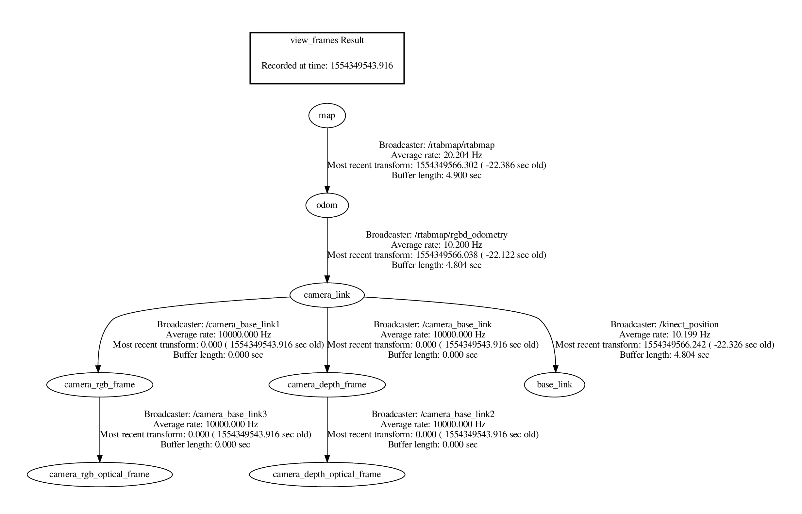

I managed to get TEB local planner working on Gudrun, though, as expected, the visual-only odometry makes the whole stack brittle. But what really matters is that we now have some sort of autonomous waypoint-following. [Full video here](https://youtu.be/KhBlflgKe1Q).

Code as of this writing is at [commit caddca1](https://github.com/tsbertalan/gudrun/commit/caddca1ca670a086d93dbaf3a1567bc4891dde9b).

<iframe width="560" height="315" src="https://www.youtube.com/embed/KhBlflgKe1Q" frameborder="0" allow="accelerometer; autoplay; encrypted-media; gyroscope; picture-in-picture" allowfullscreen></iframe>

This uses a fairly simple TF tree, half of which is internal transforms used by the Kinect.

The rqt_graph is a little more complicated, but only superficially so.

We have a chain of input from left to right--sensing (`/camera` and `/listen_to_encoder`), perception (`/rtabmap`), planning (`/move_base`, in particular `/move_base/TebLocalPlannerROS`), and finally actuation (`/ackermann_motor_controller`).

The planning process goes roughly like this: 

RTAB-map collects the RGBD data from the Kinect 1 sensor (generated using OpenNI), and performs SLAM with this data. Odometry at the moment is purely visual--no information is incorporated from the Kinect's onboard accelerometer, or from the wheel encoders. RTAB-map classifies the points it finds into obstacles and ground (based, I believe, on the angle of the local tangent vector from vertical). The obstacle points are projected down into a 2D occupancy grid.

`/move_base` subscribes to this grid topic, and then uses a heuristic planner (think A*) to generate a rough "global" path through this grid to the goal.

The TEB ("timed elastic band") looks a short distance along this global plan, and then creates a more kinematically realistic local plan that approximates this snippet of the global plan. This is done through a few iterations of an optimizer, which considers many objectives together. The resulting local plans obey, among other things, the minimum turning radius parameter for the robot, which is crucial for Ackermann steering. So, these plans often include multi-point turn maneuvers.

One of the objectives the TEB planner seeks to satisfy is a lack of collisions! The naive way to compute these is to check whether our bounding box would include any of points in the occupancy grid. Instead, the points nearest to the trajectory are coalesced into local clusters, and these are fit with polygonal shapes using a RANSAC (outlier-rejecting) regressor. This results in a much smaller, presumably geometrically analytical, set of conditions to check for collisions.

Finally, we take the `/cmd_vel` topic emitted by `/move_base` (this should be just the first control action along the TEB local path calculated at this moment), transform it into equivalent Ackermann steering angle and rear axle velocity, and pass this on to our speed/steering controller. This uses the handy [simple-pid Python package](https://pypi.org/project/simple-pid/) to keep to an assigned speed set point, though we restrict the controller output to be positive (and only give it absolute speed feedback), and instead switch the sign of the throttle according to the requested drive direction. If I had access to both channels from the encoder disk magnet, I could additionally report instantaneous direction of movement as well as magnitude, and the controller could handle the whole thing. But, anyway, this basically how it works in a real car (you can't just go instantly from forward to reverse, though braking (negative "throttle" with positive velocity) is a thing).

I think I'll need to improve the odometry before I build too much more on this somewhat shaky base, but before I do that, I'll have to try it outside at least once!

