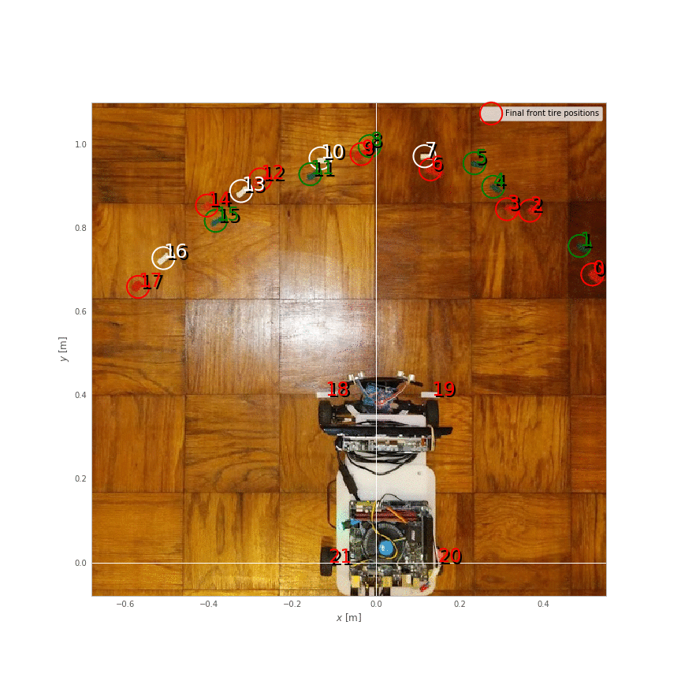

### Predicting speed from throttle

I expect that, eventually, I will need closed-loop control of speed. So, I've ordered some [tiny 2 mm cylindrical magnets](https://www.amazon.com/gp/product/B07BHF3X86/ref=ppx_yo_dt_b_asin_title_o00_s00?ie=UTF8&psc=1) and [Hall-effect sensors](https://www.sparkfun.com/products/14709), and later I'll try gluing the magnets onto the inside of my rear wheels, watching for their passage with the hall effect sensors, and getting a crude measurement of velocity from that.

But, for now, I want to know simply what are *reasonable* throttle values to use for a given requested velocity. This is a crude form of open-loop control: give the control action that your internal model says *should* be right under the current circumstances to achieve the desired process output.

At first, I dutifully made a launchfile that drove forward at a specified throttle for a couple seconds, and started measuring driven distances with my tape measure. However, I quickly realized that I could get a lot more data at higher quality if I used my ultrasound, so I wrote a [different launch file](https://github.com/tsbertalan/gudrun/blob/82daeba2927c37f7dfff13ec2c8df2948180a413/src/gudrun_motor/launch/speed_record.launch) that also started the ultrasound, and recorded time, throttle, steering, and ultrasound measurements to a [CSV file](https://github.com/tsbertalan/gudrun/blob/82daeba2927c37f7dfff13ec2c8df2948180a413/src/gudrun_motor/speed_record_data/speed_record.csv).

I then loaded this data into a [Jupyter notebook](https://github.com/tsbertalan/gudrun/blob/82daeba2927c37f7dfff13ec2c8df2948180a413/src/gudrun_motor/speed_record_data/Speed%20Record%20Data.ipynb). It quickly became clear that I could split up my experiments by looking for big spikes in the \\(\Delta t\\) between ultrasound measurements.

And then, for each experiment, there were some clear outliers--caused, I imagine, by the ultrasound picking up some spurious echoes. I rejected these in my regression by using [Scikit-learn's RANSAC linear regressor](https://scikit-learn.org/stable/modules/generated/sklearn.linear_model.RANSACRegressor.html), and tuning the `residual_threshold` parameter to reject what, to my eye, seemed appropriate for rejection in some spot checks.

In the experiment shown above, you can see that our distance to the wall decreases steadily as our fixed throttle maintains fixed speed (in equilibrium against the rolling resistance, on flat ground), until we eventually hit the wall (or, more accurately, we first hit the [`min_range`](https://github.com/tsbertalan/gudrun/blob/82daeba2927c37f7dfff13ec2c8df2948180a413/src/gudrun_sensors/listen_to_ultrasound.py#L34) for our ultrasound topic), leading to some outliers at the right side of the plot (around \\(t=1086\\) seconds)

The important thing to get from this experiment at a throttle value of 0.24 was the slope of this line--the centimeters per second value. I managed to get 23 other such pairs from the data, and created a calibration curve.

Here, I again did two more regressions, and, again, I used RANSAC to throw away one obvious outliers. I probably could have just done this manually, but I might want to get more data in the future—especially in the forward direction--and this approach generalizes better. One important thing to notice here is that there is a significant dead zone in the throttles. I could perhaps characterize this better by gathering some more data in the approach to and beyond the transition into the dead zone, especially in the forward direction.

Another thing that might be worth doing is dumping the ultrasound for this and instead using my fancy depth camera--this will be less susceptible to the echo problem of the ultrasound (which got worse as I got further from the wall). However, with the RANSAC to reject outliers, it may be possible to get significantly further from the wall than the 1.2 meters or so that I was doing in the above batch of experiments. This is important because it would enable taking data at higher speeds. 

(Here the point where I admit that, at one point, I disabled my [`MAX_THROTTLE_ABS`](https://github.com/tsbertalan/gudrun/blob/82daeba2927c37f7dfff13ec2c8df2948180a413/src/gudrun_motor/speed_record.py#L27) safeguard, and then, due to a bad command line, ended up running into the wall at max throttle, with about 15 feet of runway to get up to speed. Luckily, I had a spare [ultrasound sensor](https://www.sparkfun.com/products/13959) to replace the one that seemed to stop working at this point, and I was back online in minutes.)

### Predicting turning radius from steering effort

In addition to the throttle calibration curve, I want to know what steering effort \\( w \in [-1,1] \\) to apply to obtain a particular turning rate, as measured by our instantaneous turning radius.

For this, I did a simpler experiment: I simply ran the car forward for four seconds at a fixed throttle for each of nine steering effort values, resetting the position before each. I marked the beginning and ending positions of the tire fronts, making for eighteen marked points (0 through 17), which can be divided into nine pairs (A through I). I used [an online tool](https://apps.automeris.io/wpd/) to extract coordinates from this image. 

For each pair, I compute the center (mean) point. Then, given a driving arclength \\(d\\), and a turning radius \\(r=f/w\\), where \\(f\\) is the scaling factor to be found. I compute predicted center points as

$$x=r + r \cos(\pi - \theta)$$

$$y=r \sin(\pi - \theta)$$

for turns to the right, and

$$x=-r+r \cos(\theta)$$

$$y=-r+r\sin(\theta)$$

for turns to the left (where \\(\theta=d/2/r\\) is the faction of the full \\(2\pi\\) of the circumference that we drive in our \\(d\\)).

I then find the mean distance from these predictions to the actual endpoints, and minimize this loss function by tuning \\(d\\) and \\(w\\) using `spicy.optimize.minimize`.

There are some definite problems with this approach. In truth, there are five circles of different radii involved at any instant when the wheel of an Ackermann car is not centered: different circles for each of the four wheels, and one virtual circle that begins at the center of the back axel, which is the radius we actually want to talk about. So, a better way to do all of this would have been to mark the locations of the *back* wheels after each maneuver, or at least approximate these positions from our marked values. But this will be good enough for now.

However, tonight, my Hall effect sensors arrived, so I can next get some *real* measurments of distance traveled.